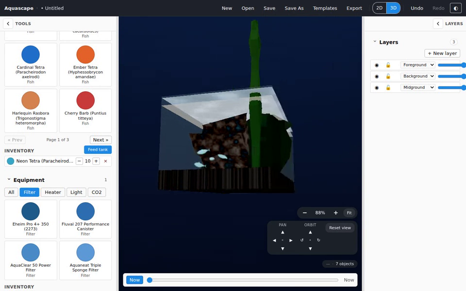

<div align="center">


# Aquascape

**Open-source aquascaping design tool — for the web, for the desktop, for free.**

[](https://github.com/joebarbere/aquascape/actions/workflows/main.yml)
[](https://github.com/joebarbere/aquascape/actions/workflows/pr.yml)
[](#license)
[](#todo--whats-next)
[](#platforms)

<br />

<!-- GitHub renders <video> with a relative src on the rendered README; the
     linked poster below is the always-works fallback. -->

<video src="docs/media/demo-3d.webm" poster="docs/media/demo-3d-poster.png" controls muted loop playsinline width="760"></video>

<a href="docs/media/demo-3d.webm"></a>

<sub>▶ **[Watch the 3D simulation demo (WebM)](docs/media/demo-3d.webm)** — orbit a planted tank, watch caustics dance across the substrate, and scrub a full day→night cycle. Generated headlessly by [`tools/demo/record-demo.mjs`](tools/demo/record-demo.mjs).</sub>

</div>

---

## What is this?

Aquascape is a design tool for planted-aquarium hobbyists. Pick a tank, sculpt the substrate, place rocks and driftwood, plant flora in layers, plan livestock and equipment — preview the result, save it, share it. Ships as **both** an Angular web SPA/PWA and an Electron desktop app from one Nx monorepo; the desktop build is fully offline-capable.

### Why another aquascaping tool?

The hobbyist tools that exist today either focus on layout (Scape It, Aquasketcher) or on stocking calculators (MyAquariumBuilder / AqAdvisor). Aquascape combines both into a single document and adds capabilities none of them ship:

- 🌱 **Deterministic plant-growth simulation** — scrub a time slider to preview weeks 0–52 of growth
- 🐟 **A living 3D preview** — schooling, feeding, territorial fish simulated in real time over the same document you edit in 2D
- 📸 **Composite onto a real tank photo** — design against the actual shelf the tank will live on
- 🤖 **Local + hosted AI render** behind one interface — planned, see [TODO](#todo--whats-next)
- 💾 **Lossless `.aqua` document format** with a locked schema (now v3) + pure migration chain
- 🆓 **Truly open-source**, MIT-licensed, no telemetry, no cloud lock-in

---

## Features

### 🐠 Tank setup

- **36 tank presets** spanning ADA Cube Garden (Mini-S → 150-P), UNS (5N → 120U), Waterbox (Clear Mini 10/16/30 + Cube 20), and US standard sizes (5 gal cube → 90 gal)
- Custom dimensions (mm / cm / inches — storage is integer mm; toggle is display-only)
- Aspect-ratio guardrail flags unusual ratios
- **Frame styles:** rimless / black-rimmed / braced
- **Water tint** picker + presets
- **Adjustable water fill line** — set the level in **mm or US gallons** (or leave it on Auto: 25 mm below the rim); the 2D tint band, the 3D water surface, and the fish/bubble simulation all follow it
- **Tank background:** solid colour or gradient (image backgrounds are planned)

### 🏞 Substrate sculpting

- Multi-region substrate with smooth blends along the tank floor
- Per-region material (6 core substrates — ADA Aqua Soil Amazonia, Tropica Aquasoil, silica sand, white aragonite, black pea gravel, Seachem Flourite)
- Profile curve editor — add/remove/edit elevation points along the front-back axis
- Renderer paints a Catmull-Rom silhouette with deterministic grain noise per-region

### 🪨 Hardscape & 🌿 plants

- **19 hardscape entries** — rocks (Seiryu × 2, Ohko Dragon, Frodo, Pagoda Yamaya, Black Lava, Texas Holey, Elephant Skin, Petrified Wood, Polar Ice, Iota, Snow Mountain) + wood (Spiderwood, Manzanita, Malaysian, Mopani, Cholla, Bonsai, Redmoor)
- **28 plant entries** across foreground carpets, midground, background — each with a normalized silhouette, growth params, and optional carpet-brush density
- Paginated palette browsers with filter chips
- Pointer drag-and-drop onto the canvas

### 🎯 Precision editing

- **Click-drag** to move; **drag corner handles** to scale; **drag the rotate dot** to rotate
- **Shift-marquee** for multi-select (Sketch-style centre-in-rect)
- **Floating selection inspector** — Mirror H/V, Duplicate, Z-up/down, Delete
- **Keyboard shortcuts** — Del, Cmd+D, Cmd+G (group), `[` / `]` (z-order)
- **Snap-to-everything** — grid / guides / objects, with magenta alignment lines while dragging
- **Drag readouts** — `X, Y mm` for move, `% × %` for scale, `°` for rotate
- **Composition overlays** — golden ratio + rule of thirds + focal-point markers (view-only)
- **Layers panel** — visibility / lock toggles, inline rename, opacity, reorder, per-layer depth zone

### 🌱 Growth simulation

- **Time slider** — scrub weeks 0–52 to preview plant growth
- Deterministic: the document-level `seed` means the same scene grows the same way on every machine, every time
- Carpet plants scatter-place with seeded jitter; growth scales every plant along a logistic curve toward its catalog maturity

### 🐟 Livestock & equipment planning

- **24 livestock species** — 20 fish (neon + cardinal + ember tetras, harlequin rasbora, cherry + tiger barb, marbled hatchetfish, dwarf + pearl gourami, angelfish, discus, German blue ram, apistogramma cacatuoides, betta, kuhli loach, pygmy + bronze cory, otocinclus, bristlenose + common pleco) + 2 shrimp (cherry, crystal red) + 2 snails (nerite, ramshorn)
- **18 equipment entries** — Eheim Pro 4+ / Fluval 207 / AquaClear 50 / sponge filters, Fluval E300 / Eheim Jager 200 / Cobalt Neo-Therm 100 heaters, **9 real LED lights** (Twinstar 600S, Chihiros WRGB II Pro 60, Fluval Plant 3.0, NICREW ClassicLED Plus, Finnex Planted+ 24/7, ADA Solar RGB, Kessil A360X Tuna Sun, ONF Flat One+, Current USA Satellite Plus PRO — with manufacturer-published lumens / colour temperature / beam specs), Co2Art SE + ADA Pollen Glass CO2
- **Stocking guidance** — six rule-based, explainable warnings: bioload vs. tank litres, temperature/pH range intersections, peaceful+aggressive temperament clash, schooling-below-minimum, fin-nipper presence
- **Inline note editing** on each equipment row
- All edits flow through the undo/redo Command pipeline

### 🧊 3D view

- **One-click toggle** between 2D, 3D, and fish-eye in the editor toolbar — segmented `2D | 3D | Fish eye` control, or `Cmd/Ctrl+Shift+3` for 2D ↔ 3D
- Three.js / WebGL renderer reads the **same** `.aqua` document — every change you make in 2D shows up immediately in 3D
- **Orbit camera** — drag to rotate around the tank, wheel to zoom, two-finger drag to pan
- **Fish-eye view** — ride a fish through the tank: the camera parks at a live fish's eye with a wide fisheye FOV and follows its swimming, schooling, and startles in first person
- **Overhead equipment lighting** — attach a real LED fixture from the catalog and a glowing light bar appears above the rim, casting its published colour temperature + lumen-scaled light into the tank (dims with the day-night cycle)
- Physically-based glass with transmission + refraction, ACES filmic tone mapping, image-based lighting, soft shadows, bloom
- **Procedural underwater caustics** on substrate, hardscape, and the water surface — faded by the day-night cycle
- **Catalog-driven PBR textures** — substrate / hardscape / plant materials sample 9 deterministic, seamlessly-tiling texture families (triplanar, world-space)
- **Animated water surface** (vertex-shader sine bands) at the adjustable fill line
- **Day-night cycle** — scrub a phase slider (manual / real-time / equipment photoperiod modes); lighting, background tint, and plant emissive follow a midnight / dawn / noon / dusk ramp
- **Plant sway** — height-weighted, flow-coupled (plants near a filter outflow wave wider _and_ faster), deterministic per instance
- The time slider works in 3D too — scrub plant growth over weeks
- **Read-only by design** — editing happens in 2D; flip to 3D to visualise

### 🐠 Living tank simulation

Every livestock entry in the document becomes visible, behaving fish in the 3D view — deterministically spawned from the document's `seed`, simulated at a fixed 30 Hz by a bitECS entity-component system:

- **Seven procedural fish archetypes** (slim-tetra, deep-bodied, barb, cory-cylinder, eel, hatchet-wedge, crawler) with carangiform tail-beat + per-fin flutter shaders, per-instance colour, and an iridescent sheen
- **Schooling** — Couzin three-zone model (repulsion / orientation / attraction with a blind cone); tetras shoal, loners wander
- **Vertical stratification** — hatchetfish hug the surface, tetras roam mid-water, cories scoot along the substrate; shrimp + snails crawl
- **Territoriality** — cichlids claim and defend hardscape caves (owner-wins chases with fatigue)
- **Fin-nipping** — tiger barbs harass long-finned, slow-swimming tankmates (suppressed when their own school is large enough — just like real ones)
- **Fear & startle waves** — frightened fish dart to cover, and panic ripples through a school; a predator (the angelfish) keeps prey on edge
- **Feeding** — a "Feed tank" button drops food sprites; surface / midwater / substrate feeders find food at their band, otos graze algae off rocks (it regrows), detritivores wander the floor
- **Flow & physics** — filter equipment bakes a divergence-free flow field that drags fish; a hardscape signed-distance-field deflects them off rocks; air stones stream wobbling bubble columns
- **Deterministic & budgeted** — same seed ⇒ same simulation, byte-identical over a 1000-tick replay; the full system steps in 3.43 ms p95 at 200 fish (4 ms budget)
- A dev-only **behaviour debug overlay** (Ctrl/Cmd+Shift+D) shows each fish's mode, territory anchor, and refuge

### 📦 Templates

- Four built-in starter templates — **Iwagumi** / **Dutch** / **Jungle** / **Beginner**
- Save your own as a personal template (capped at 32 entries)
- "New from template" mints a fresh untitled scene from the chosen layout

### 💾 Save, share, export

- Lossless `.aqua` document format (ZIP container with embedded assets, falls back to bare JSON) — versioned with a pure migration chain, so old files always open
- Crash-recovery autosave debounced every 3 s
- Recent-files menu
- **Image export** — PNG / JPEG at 1080p / 2K / 4K
- **Setup-sheet export** — Markdown / JSON combining tank dimensions, water volume, plants, hardscape, livestock per-species stats, equipment per-item stats, and the live stocking-warnings list

### 🎨 UX polish

- **Per-panel accordion collapse** with state persisted to local storage
- **Resizable, collapsible sidebars** — drag the separator to size each pane
- **Responsive layout** — sidebar drawers below 768 px, auto-collapse right rail at tablet width
- **Cursor-anchored Cmd/Ctrl + wheel zoom** (10 %–1000 % of fit-to-window)
- **Photo backdrop** — composite your design onto a photo of the real tank's location
- **Wall background** — a configurable surface behind the tank for room-context visualisation
- **Geometric-A brand mark** rendered at every dock / favicon / install size

---

## Platforms

| Platform                    | Bundle                                                                                            | Status                |
| --------------------------- | ------------------------------------------------------------------------------------------------- | --------------------- |
| **Web (Angular SPA + PWA)** | Installable via browser "Install Aquascape" prompt; offline-capable via `@angular/service-worker` | ✅ Shipped            |
| **Desktop (Electron)**      | macOS DMG (arm64 + x64), Windows NSIS (x64), Linux AppImage (x64)                                 | ✅ Shipped (unsigned) |

> **Note on the macOS installer:** code signing is OFF for the current open-source build. Gatekeeper requires right-click → Open the first time (or `xattr -d com.apple.quarantine Aquascape.app`). Production distribution will need an Apple Developer ID + Windows EV certificate.

---

## Quick start

```bash
corepack enable                              # one-time, picks up the pinned pnpm
pnpm install

pnpm exec nx serve web                       # → http://localhost:4200
pnpm exec nx serve desktop                   # web dev-server + Electron, in parallel
pnpm exec nx build desktop                   # → dist/apps/desktop/{main,preload}/
pnpm package:desktop                         # → dist/apps/desktop/installers/

pnpm exec nx graph                           # browse the dependency graph
pnpm exec nx run-many -t test                # full unit-test suite
pnpm exec nx test <project> --configuration=ci  # with coverage + threshold gate
pnpm exec nx run-many -t lint                # module-boundary lint over every project
pnpm exec playwright install chromium        # one-time, ~150 MB — Playwright browser binaries
pnpm exec nx run web-e2e:e2e                 # boots `nx serve web` + runs real-browser specs
```

New to the codebase? Start with the **[new-developer guide](docs/guides/new-developer-guide.md)**.

---

## TODO — what's next

Everything above is shipped. Remaining work, roughly in priority order:

- [ ] **Release pipeline** — `pnpm release <version>`, electron-builder installers published to GitHub Releases. The version scheme is an open maintainer decision (ADR-0005 pending). See [`plans/stage-12-release-pipeline.md`](plans/stage-12-release-pipeline.md).
- [ ] **3D fidelity: real-GPU validation loop** — choose between local GPU dev, a GPU CI runner, or a manual checklist (maintainer decision). Blocks the next item.
- [ ] **3D fidelity: SSAO + screen-space water refraction** — multi-pass render-target effects that blank under software WebGL; gated behind `getRenderTargetEffectsSupported()` and the validation loop above. See [`plans/3d-fidelity-followups.md`](plans/3d-fidelity-followups.md).
- [ ] **Community gallery** — browse + remix shared layouts. See [`plans/stage-8-community-gallery/`](plans/stage-8-community-gallery/).
- [ ] **AI photorealistic render** — local + hosted providers behind one interface; keys live in OS secure storage, never in the document. See [`plans/stage-9-ai-render/`](plans/stage-9-ai-render/).
- [ ] **Bubble fluid fidelity pass** — `createBubbleSlice` / `stepBubbleSlice` (a Stam 1999 advect/diffuse/project loop) is wired in `domain/fluid-sim` but unused; bubbles currently rise on a simple kinematic path.
- [ ] **Image tank backgrounds** — solid + gradient ship today.
- [ ] **Per-species fish textures** — deferred; fights per-archetype instancing and the WebGL 16-attribute budget.
- [ ] **Code signing** — Apple Developer ID + Windows EV certificate for production installers.
- [ ] **Empty placeholders to fill** — `libs/ui/` (shared presentational components), `apps/desktop-e2e/` (Playwright-Electron).

The full stage-by-stage record of what shipped when lives in [`docs/history.md`](docs/history.md).

---

## Documentation

**[`docs/README.md`](docs/README.md) is the documentation hub** — organized by role (user, new contributor, feature developer, architect) and by topic, with diagrams throughout.

| You want to…                                 | Read                                                                                                                                            |
| -------------------------------------------- | ----------------------------------------------------------------------------------------------------------------------------------------------- |
| Understand the big picture                   | [Architecture overview](docs/architecture/overview.md) (diagrams of every layer + data flow)                                                    |
| Get productive as a new contributor          | [New-developer guide](docs/guides/new-developer-guide.md)                                                                                       |
| Look up a term                               | [Glossary](docs/glossary.md)                                                                                                                    |
| Understand a specific subsystem              | [`docs/architecture/`](docs/architecture/) — scene model & commands, document format, rendering, state, platform, catalog, livestock simulation |
| Know when something shipped                  | [Development history](docs/history.md)                                                                                                          |
| Avoid a known gotcha while changing an area  | [`docs/caveats/`](docs/caveats/) (indexed by area)                                                                                              |
| Understand a one-time architectural decision | [`docs/decisions/`](docs/decisions/) (ADRs)                                                                                                     |
| Read the original spec                       | [`aquascape-development-plan.md`](aquascape-development-plan.md)                                                                                |

### Architecture in four sentences

- **One scene model, two renderers.** `domain/scene-model` is framework-free; `renderer-2d` (canvas) and `renderer-3d` (Three.js) both implement the same `SceneRenderer` interface over the same canonical mm coordinates stored in `.aqua` documents.
- **Every mutation is a `Command`** with apply/invert — undo/redo, persistence, and future collaboration all build on this single primitive; the UI never mutates the scene directly.
- **One feature codebase, two apps.** Features depend on the `platform-api` interface, never a concrete platform; `apps/web` injects `platform-web`, `apps/desktop` injects `platform-electron`.
- **Layering is mechanical.** Nx tags + `@nx/enforce-module-boundaries` make an illegal import fail `nx lint`.

---

## Project layout

```
apps/
  web/             Angular SPA/PWA — the browser app
  web-e2e/         Playwright real-browser specs (SwiftShader WebGL in CI)
  desktop/         Electron main + preload — the desktop app
libs/
  domain/          Framework-free pure logic
    catalog/       Substrates, hardscape, plants, livestock, equipment data
    document/      `.aqua` schema, validator, migrations, marshal
    fish-anatomy/  Seven procedural fish archetype geometry generators
    fluid-sim/     FlowField + HardscapeSdf + bubble bakes
    geometry/      Vec2/3, transforms, hit-test, snap helpers
    growth-sim/    Deterministic plant-growth math
    livestock-behaviors/  Behaviour param types + presets + resolveBehavior
    livestock-ecs/ bitECS world + behaviour/physics/animation systems
    scene-model/   Scene/Layer/Object types + Command pipeline + history
    stocking/      Stocking-guidance rules engine
  rendering/
    renderer-api/  The `SceneRenderer` interface contract
    renderer-2d/   Canvas2D implementation (editing surface)
    renderer-3d/   Three.js implementation (read-only 3D view)
    livestock-renderer-3d/  InstancedMesh-per-archetype fish renderer
  features/        Angular feature libs (one per tool / panel)
  platform/        platform-api interface + platform-web + platform-electron
  state/           NgRx scene / document / selection slices
  ui/              Shared presentational components (placeholder)
  testing/         fast-check arbitraries + the round-trip property suite
tools/             Workspace tooling (scaffold, icons, packaging, validators, demo recorder)
docs/
  README.md        Documentation hub — start here
  architecture/    How each subsystem works (with diagrams)
  guides/          New-developer onboarding
  glossary.md      Dictionary of every term
  history.md       Stage-by-stage development record
  decisions/       Architectural Decision Records (ADRs)
  caveats/         Area-specific load-bearing gotchas (load by topic)
```

---

## Contributing & docs

- **Start here:** the [new-developer guide](docs/guides/new-developer-guide.md) and the [documentation hub](docs/README.md).
- **The spec:** [`aquascape-development-plan.md`](./aquascape-development-plan.md) — roadmap, architectural decisions, feature traceability, extended by [`plans/`](./plans/).
- **Working on the codebase:** [`CLAUDE.md`](./CLAUDE.md) carries architecture invariants, the Definition of Done, dev commands, and the caveat-file index.
- **Architecture decisions:** [`docs/decisions/`](./docs/decisions/) — the foundational ADRs.
- **Area gotchas:** [`docs/caveats/`](./docs/caveats/) — when a change touches `libs/domain/document/`, load `docs/caveats/document-format.md`; when it touches `libs/rendering/renderer-2d/`, load `docs/caveats/renderer-2d.md`; etc.

CI runs `nx affected -t lint test build` plus a per-lib coverage gate, a real-browser Playwright e2e job (chromium, cached binaries, asserts a fish actually paints in 3D), and the `document-round-trip` property suite — on every PR. The full OS matrix runs on every push to `main`. The `document-round-trip` job is required — a format/loader regression fails the PR.

---

## License

MIT.
