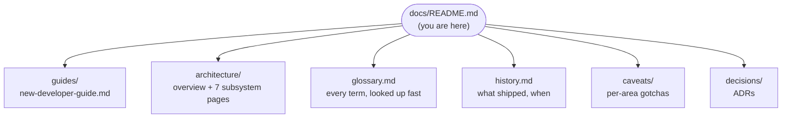

# Aquascape documentation hub

Welcome. Everything written about this project is reachable from this
page — pick your entry point by **role**, or jump straight to a **topic**.

## Start by role

| Role | Your path |
| --- | --- |
| **User / hobbyist** | [README feature list](../README.md#features) → run the app → [glossary](glossary.md) for any unfamiliar term |
| **New contributor (any level)** | **[New-developer guide](guides/new-developer-guide.md)** — setup, guided tour, mental model, first contribution, paths per background |
| **Feature developer** | [Architecture overview](architecture/overview.md) → the subsystem page for your area → its [caveat file](caveats/) **before** you edit |
| **Reviewer / architect** | [Architecture overview](architecture/overview.md) → [ADRs](decisions/) → [`CLAUDE.md`](../CLAUDE.md) (invariants + Definition of Done) |
| **Content author (no code)** | [Catalog](architecture/catalog.md) → [catalog caveats](caveats/catalog.md) (data-sourcing rules) |
| **QA / test engineer** | [New-developer guide §testing](guides/new-developer-guide.md#7-testing--what-runs-where) → [e2e caveats](caveats/e2e.md) |

## Architecture — how it works

Start with the **[overview](architecture/overview.md)** (layer diagram,
data flow, determinism); then go deep per subsystem:

| Page | Covers |
| --- | --- |
| [Scene model & commands](architecture/scene-model-and-commands.md) | The in-memory model, the Command mutation pipeline, undo/redo |
| [Document format](architecture/document-format.md) | The `.aqua` file: container, rules, versions, migrations, marshal |
| [Rendering](architecture/rendering.md) | The `SceneRenderer` contract, the 2D editing canvas, the 3D view, the toggle |
| [State management](architecture/state-management.md) | NgRx slices, the command effect, document lifecycle, autosave |
| [Platform abstraction](architecture/platform-abstraction.md) | One codebase → web + Electron; the four services; Electron security |
| [Catalog](architecture/catalog.md) | Content-as-data: manifests, schema, loader, textures |
| [Livestock simulation](architecture/livestock-simulation.md) | The ECS world, behaviour systems, 30/60 Hz loop, determinism |

## Reference

| Resource | What it's for |
| --- | --- |
| **[Glossary](glossary.md)** | The dictionary — hobby terms, code types, rendering and simulation vocabulary, tooling |
| **[History](history.md)** | The stage-by-stage development record + document/catalog version history |
| **[Caveats index](caveats/README.md)** | Load-bearing gotchas per area, each with a "Load this when…" trigger. **Read the matching file before changing an area.** |
| **[Decisions (ADRs)](decisions/)** | Why Electron tooling, pnpm, Jest coverage, Nx Cloud deferral were decided the way they were |
| **[The spec](../aquascape-development-plan.md)** | The original development plan — roadmap, feature traceability |
| **[`plans/`](../plans/)** | Per-feature implementation plans, including the still-open ones |
| **[`CLAUDE.md`](../CLAUDE.md)** | Working agreements: invariants, Definition of Done, dev commands, AI-assisted workflow |

## Visuals

- The **[3D demo video](media/demo-3d.webm)** ([poster](media/demo-3d-poster.png)) — recorded headlessly by [`tools/demo/record-demo.mjs`](../tools/demo/record-demo.mjs)
- **Screenshots** of the editor live in [`media/`](media/) and are embedded throughout the guides
- Every architecture page carries **Mermaid diagrams** (rendered natively by GitHub) — layer maps, sequence diagrams, state machines

## Documentation rules (for contributors)

Documentation drift is treated like a failing test. When a change lands:

- New user-visible capability → README feature bullet (+ TODO line removed if it closes one)
- New gotcha discovered → the area's `caveats/*.md` (new area → new file + a row in the caveats index **and** the `CLAUDE.md` table)
- New subsystem or contract → an `architecture/` page or section + a hub link here
- New term of art → a [glossary](glossary.md) row
- One-time architectural choice → an ADR in `decisions/`
- Stage/milestone completion → a `history.md` entry

All bundled into the same PR as the feature (or a trailing `docs:` commit).
