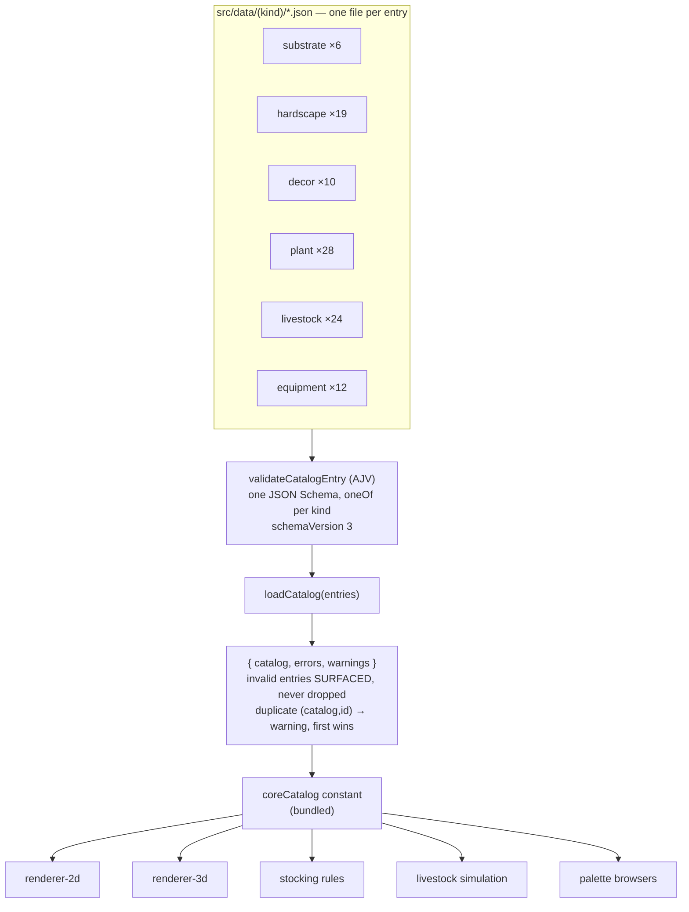

# The catalog — content as data

> **Load this when:** you want to understand where tanks, substrates,
> rocks, plants, fish, and equipment come from, or you're adding content.
> Source: [`libs/domain/catalog/`](../../libs/domain/catalog/).
> Gotchas + authoring rules: [`docs/caveats/catalog.md`](../caveats/catalog.md).

Everything placeable or plannable in the app is **data, not code**: a JSON
manifest per entry, validated by a JSON Schema, loaded into a typed
`Catalog` at module-import time. Scenes reference entries by `CatalogRef`
(`catalog` + `id` + `version`) and never inline catalog data.

## The data model

`CatalogEntry` is a discriminated union over the six kinds. What each kind
carries (beyond id/name/description/tags):

| Kind | Notable fields |
| --- | --- |
| `substrate` | colour, grain params, `textures?` |
| `hardscape` | category (rock/wood/other), normalized silhouette, natural size, `coverScore?` (refuge value — loader defaults wood 0.6 / rock 0.4), `textures?` |
| `decor` | category (wreck/ruin/bones/structure), normalized silhouette + colour (2D), natural size, `coverScore?` (loader defaults structure 0.6 / wreck 0.5 / bones 0.4 / ruin 0.3), required `model` (.glb ref — the GLB carries its own PBR materials, so no `textures?`) |
| `plant` | zone (foreground/midground/background), silhouette, growth params (`weeksToMature`, `sizeAtZero`), carpet density, `textures?` |
| `livestock` | group, size, water params (`temperatureRange`, `pHRange`), `bioloadClass`, temperament, `schoolingMin`, `predator?`, `behavior?` (schooling / depth / animation / territory / nipping / fear overrides) |
| `equipment` | category (filter/heater/light/CO2), settings, `flow?` (outflow/intake for the flow field), `airRateMl?` (bubble source), `photoperiodHours?` |

Tank presets are a separate typed list (`tank-presets.ts`), each with a
documented real-world source — **no fabricated dimensions**.

## Design rules

- **Schema is shape; semantics are advisory.** JSON Schema can't express
  `minC < maxC`, so cross-field rules are documented in `description` and
  manifest authors are trusted. Don't fabricate species data — use
  conservative numbers from known hobbyist sources and note the choice in
  the entry's `description`.
- **Additive evolution.** New optional fields (`behavior`, `coverScore`,
  `flow`, `airRateMl`, `photoperiodHours`, `textures`) land without a
  schemaVersion bump when older manifests still load unchanged;
  `additionalProperties: false` everywhere catches typos at load time.
- **Defaults belong to one owner.** Some fields default in the loader
  (`coverScore` by category), some at resolve time
  (`resolveBehavior()` presets), some are pure pass-through (`textures`).
  Check before adding a default in a second place.
- **Validator regen is mandatory** after a schema edit:
  `pnpm precompile:validators` — CI diffs the generated `.cjs`.

## Adding an entry (the short version)

1. Drop a JSON manifest into `libs/domain/catalog/src/data/<kind>/`.
2. Add the import to `core-catalog.ts`.
3. `node tools/validate-catalog.mjs` to check it.
4. If it's livestock with unusual behaviour, consider whether the
   heuristic resolution in `livestock-behaviors` already covers it before
   authoring an explicit `behavior` block — most rows leave it absent.

## Textures

The optional `textures?: { albedo?, normal?, roughness? }` refs point into
a pack of 27 deterministic, seamlessly-tiling 256² PNGs (9 families ×
3 maps) baked offline by `tools/generate-textures.mjs`
(`pnpm generate:textures`) and committed under
`libs/domain/catalog/assets/textures/`. The 3D renderer applies them
triplanar in world space, opt-in via `RenderOptions.catalogTextureBaseUrl`;
the 2D renderer ignores them. Livestock is deliberately excluded (instanced
rendering + the WebGL attribute budget — see
[`docs/caveats/livestock-ecs.md`](../caveats/livestock-ecs.md)).

## Decor models

Each `decor` entry's required `model` ref points to a glTF binary under
`libs/domain/catalog/assets/models/` (served at `assets/catalog-models/`),
baked deterministically offline by `tools/generate-decor-models.mjs`
(`pnpm generate:models`). The GLBs carry geometry, vertex colours, and
`MeshPhysicalMaterial` PBR parameters via KHR extensions (clearcoat,
transmission + IOR, iridescence, emissive strength) — no embedded images.
Authoring contract: millimetre units, Y-up, origin bottom-centre, front
faces +Z, bounding box exactly the entry's `naturalSize`. The 3D renderer
loads them opt-in via `RenderOptions.catalogModelBaseUrl`; the 2D renderer
paints the entry's silhouette instead.
