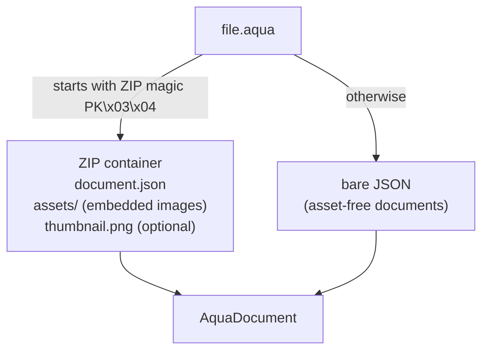
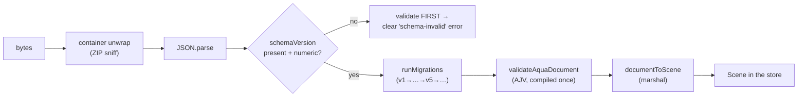

# The `.aqua` document format

> **Load this when:** you want to understand what's inside a saved file,
> how versioning/migrations work, or how a document becomes a `Scene`.
> Source: [`libs/domain/document/`](../../libs/domain/document/).
> Gotchas + the change checklist: [`docs/caveats/document-format.md`](../caveats/document-format.md).

`.aqua` is the single persistent artifact of the app. One file is one
design: tank, substrate, hardscape, plants, livestock, equipment, and the
seed that makes every derived simulation reproducible.

## Two sources of truth, kept in lockstep

- [`aqua-document.ts`](../../libs/domain/document/src/aqua-document.ts) —
  the canonical TypeScript types.
- [`aqua-document.schema.json`](../../libs/domain/document/src/schema/aqua-document.schema.json) —
  the JSON Schema mirror, compiled by AJV for runtime validation.

**Both must change together**, along with the worked example
[`example.aqua.json`](../../example.aqua.json) (the canonical round-trip
fixture) and the in-memory mirror in `scene-model`'s `types.ts`.
`node tools/validate-example.mjs` is the one-line sanity check.

## The container

Readers sniff the magic bytes and accept both. Packing/unpacking uses
`fflate` (`packAquaDocument` / `loadAquaDocument`).

## The format rules (locked since v1)

| Rule | Why |
| --- | --- |
| Canonical units = **millimetres**, integers preferred | cm/in are display-only conversions; one unit ends rounding drift |
| One right-handed 3D coordinate space, origin front-bottom-left, +x right / +y up / +z back | 2D projects along −z; 3D consumes the same numbers — no per-renderer spaces |
| Catalog by reference (`CatalogRef`), never inlined | documents stay small; catalog content evolves independently |
| Plain serializable data — `JSON.parse(JSON.stringify(doc))` lossless | round-trips, diffs, property tests |
| `schemaVersion` + pure, total `Migration` chain | old files always open |
| `extensions` bag + optional fields | older readers preserve newer data ("don't drop what you don't understand") |
| Document-level `seed` | deterministic scatter, growth jitter, fish simulation |

## Versions so far

| Version | Added / Removed | Migration |
| --- | --- | --- |
| v1 | The locked baseline | — |
| v2 | `Layer.zone?` (foreground / midground / background — 3D depth banding) | identity version-stamp |
| v3 | `Tank.waterLevelMm?` (adjustable water fill line) | identity version-stamp |
| v4 | `Tank.waterChemistry?` (persisted water-sim snapshot — Stage 13 F13.2) | identity version-stamp |
| v5 | **Removed** `renderHistory` / `RenderRecord` (AI render dropped from scope) | strips `renderHistory` if present |

The v2–v4 additions are optional + additive: a migration **must not invent
a value** for them. "Absent" has meaning — e.g. no `waterLevelMm` means
"default fill", computed at consume time by scene-model's
`effectiveWaterLevelMm()` (tank height − 25 mm), never materialised into
the file. v5 is the first **removal**: its migration deletes the
`renderHistory` key (pure rest-destructure, no mutation) so a doc that
carried it loads cleanly under the v5 schema's `additionalProperties:
false`. On every real document the strip is a no-op — no shipped writer
ever emitted the field.

## The load pipeline

The preflight order matters: a document missing `schemaVersion` is
validated *before* migration so the user sees a schema error, not a
confusing "missing migration 0 → 1".

## Marshal: document ⇄ scene

`documentToScene` / `sceneToDocument` translate between the on-disk
envelope and the in-memory `Scene`:

- **Livestock + equipment live on `Scene`** (so commands can mutate them
  for undo/redo); the marshal moves them between `doc.*` and `scene.*`.
  They are deliberately *not* on the document envelope twice — one writer
  per field.
- **`extensions` rides the envelope verbatim** — load → edit → save never
  drops fields the editor doesn't model. `extensions` is the
  forward-compatibility escape hatch. (The `renderHistory` envelope field
  was retired in schema v5 when the AI render feature was dropped from
  scope — the envelope is now strictly `{ meta, extensions? }`.)

## Changing the format — the non-negotiable checklist

Any schema change requires, in one PR:

1. A new `{ from: N, to: N+1, migrate }` entry appended to
   `AQUA_MIGRATIONS` — pure and total (no I/O, handles every valid vN doc).
2. `CURRENT_SCHEMA_VERSION` bumped; types + schema + `example.aqua.json`
   updated together.
3. The previous example preserved as a historical fixture
   (`__fixtures__/example.vN.aqua.json`) with a migration spec.
4. A fast-check round-trip property test in `libs/testing` covering the
   new step.
5. `pnpm precompile:validators` re-run (CI diffs the generated validator).

The `document-round-trip` CI job is **required on main** — a format/loader
regression fails the PR. Format changes are owned by the
`aqua-document-guardian` sub-agent when working with Claude Code.
