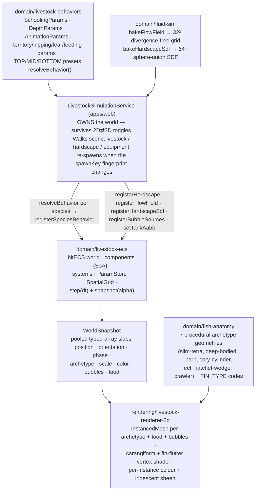
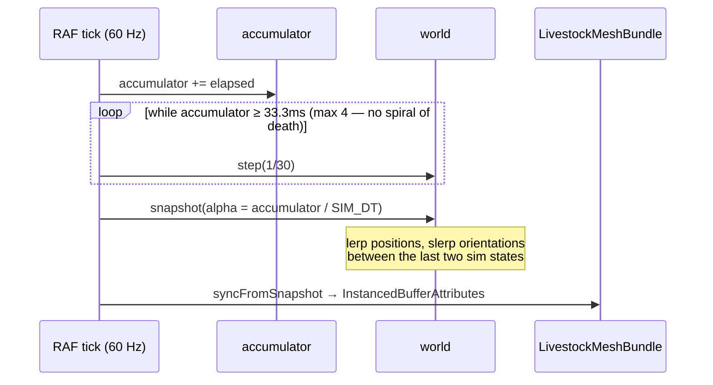

# The livestock simulation — how the fish come alive

> **Load this when:** you want to understand the real-time fish simulation
> behind the 3D view — the ECS world, the behaviour systems, determinism,
> and how it all stays at 60 fps.
> Sources: [`libs/domain/livestock-ecs/`](../../libs/domain/livestock-ecs/),
> [`libs/domain/livestock-behaviors/`](../../libs/domain/livestock-behaviors/),
> [`libs/domain/fish-anatomy/`](../../libs/domain/fish-anatomy/),
> [`libs/domain/fluid-sim/`](../../libs/domain/fluid-sim/),
> [`libs/rendering/livestock-renderer-3d/`](../../libs/rendering/livestock-renderer-3d/).
> Gotchas: [`docs/caveats/livestock-ecs.md`](../caveats/livestock-ecs.md).

The document stores only *species + quantity*. Everything you see —
positions, schools, chases, bubbles — is derived at runtime,
**deterministically from `scene.seed`**: open the same file twice and the
tank plays out identically, byte-for-byte over a 1000-tick replay.

## The cast of libraries

Hard boundaries worth knowing:

- **The renderer never imports bitECS** — it consumes only the
  `WorldSnapshot` slabs. The snapshot is *pooled*: don't retain it across
  calls.
- **Species params live once per species** in the world's `ParamStore`
  (entities carry a 4-byte handle), not per fish.
- **`tankAabb.maxY` is the waterline**, not the glass rim — built from
  `effectiveWaterLevelMm`, the same selector the water plane renders at,
  so fish, bubbles, and surface food never float in the air gap.

## One tick: the system pipeline

The world steps at a fixed **30 Hz** (`SIM_DT = 1/30`). System order is a
contract — each system has a reserved seat:

```mermaid
flowchart TD
    P["PerceptionSystem — rebuilds the SpatialGrid"]
    F["FearSystem — risk → FORAGE→REFUGE flips,<br/>nearest-cover refuge, startle-wave propagation"]
    N["NippingSystem — group-threshold-suppressed<br/>nips at long-finned victims (PURSUE for a tick)"]
    T["TerritorialSystem — bourgeois owner-wins<br/>chases with fatigue decay"]
    FE["FeedingSystem — hunger, food-sprite + algae<br/>targeting per FeedingCategory, algae regrowth"]
    CU["CuriositySystem — boldness-gated Poisson<br/>glass-surfing darts"]
    S["SchoolingSystem — Couzin ZOR/ZOO/ZOA + blind cone,<br/>Reynolds separation/alignment/cohesion<br/>(skipped when mode ≠ FORAGE)"]
    D["DepthSystem — vertical band preference<br/>(ALWAYS runs, even fleeing)"]
    FF["FlowFieldSystem — trilinear-sample the baked<br/>flow grid, drag-coupled force"]
    SI["SteeringIntegrator — sum forces,<br/>clamp maxForce + maxTurnRate"]
    C["CollisionSystem — SDF deflect off rocks +<br/>fish-vs-fish separation via SpatialGrid"]
    K["KinematicSystem — integrate velocity,<br/>clamp to tank AABB (crawlers: Y-velocity capped)"]
    A["AnimationSystem — tail-beat phase (visual only)"]
    POST["FoodSpriteLifetime → BubbleSourceSpawn →<br/>BubbleLifetime (helical rise, despawn at waterline)"]
    P --> F --> N --> T --> FE --> CU --> S --> D --> FF --> SI --> C --> K --> A --> POST
```

**Priority arbitration** runs through a per-fish `BehaviorMode`
(FORAGE / REFUGE / PURSUE) rather than force blending: Fear can flip a
fish into REFUGE; Nipping and Territorial claim PURSUE for exactly one
tick; Schooling and Curiosity stand down when the mode isn't FORAGE so the
dominant behaviour isn't diluted. Depth, flow, and collision are additive
forces that always apply.

## 30 Hz sim, 60 Hz render

The ECS lib exposes only `step(dt)` + `snapshot(alpha)`; the 3D renderer's
RAF loop owns the clock:

The perf budget is **≤ 4 ms p95 per ECS step at 200 fish** (measured
3.43 ms). The bench is opt-in:
`BENCH=1 pnpm exec nx test domain-livestock-ecs -t perf-bench`. Zero
per-tick allocation in the hot path is part of the contract.

## Determinism rules (the load-bearing ones)

- **No `Math.random()`** — lint-enforced in the lib. All draws go through
  `seededHash01` from `domain/geometry`.
- Two PRNG streams from `scene.seed`: a **spawn PRNG** (initial positions /
  orientations / phases) and a **tick PRNG** (`seed ⊕ tickCounter ⊕ keys`).
- Per-entity PRNG keys use the stable `spawnIndex`, never the raw bitECS
  eid (eids come from a module-global cursor and differ across worlds).
- Snapshot ordering for bubbles is sorted by `(sourceEid, spawnSeq)` for
  the same reason.
- `NO_ENTITY_REF = 0xffffffff` is the "no anchor / no refuge" sentinel —
  eid 0 is a *valid* entity.
- The gate: the 1000-tick byte-identical replay spec. If your change
  breaks it, the change is wrong (or the fixture needs a deliberate,
  reviewed update).

## When does the tank re-spawn?

The service fingerprints the inputs into a `spawnKey`: the seed, the
livestock list, hardscape entries (refuges + SDF), and an equipment digest
(positions, flow rates, air rates). Any change re-bakes the flow field +
SDF, re-registers sources, and deterministically re-spawns the fish. There
is no surgical update path — rebuild-on-change keeps determinism simple.

## Debugging

- **Behaviour debug overlay** (dev builds): `Ctrl/Cmd+Shift+D` or
  `?debug-behavior=1` — per-fish archetype, `BehaviorMode`, territory
  anchor, refuge.
- **e2e debug hook**: `window.__aquascape_debug__`
  (getWorld / getEntityCount / getScene / getViewMode), read-only, dev
  builds only — the contract is in [`docs/caveats/e2e.md`](../caveats/e2e.md).
