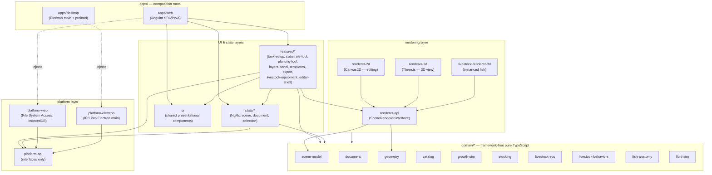
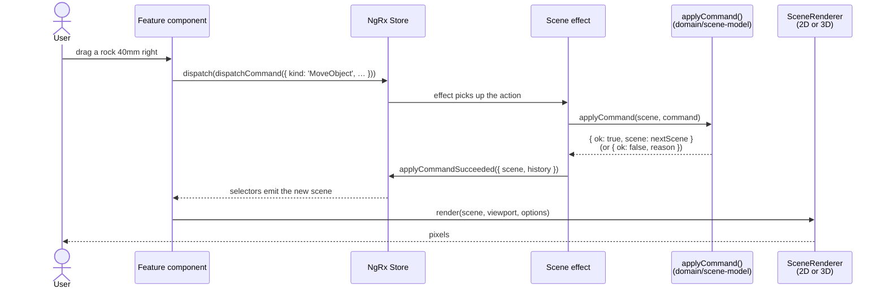
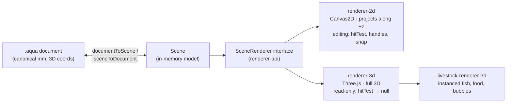
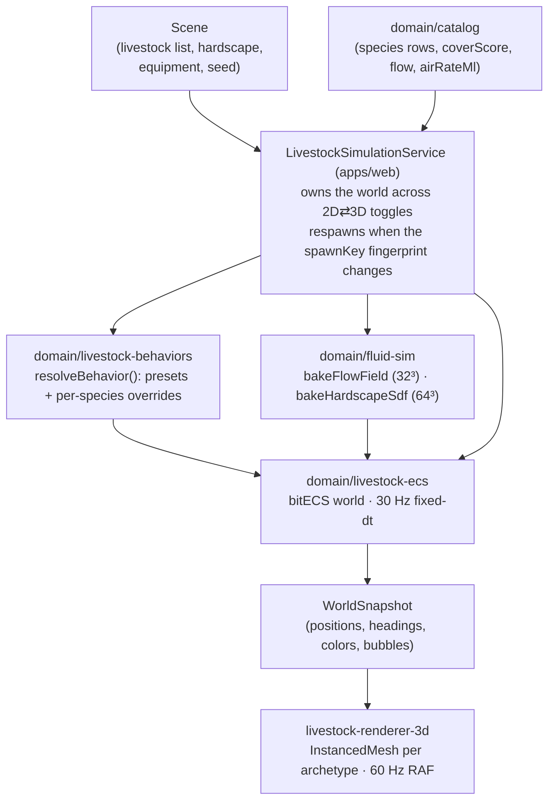
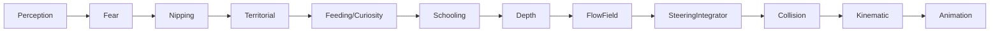
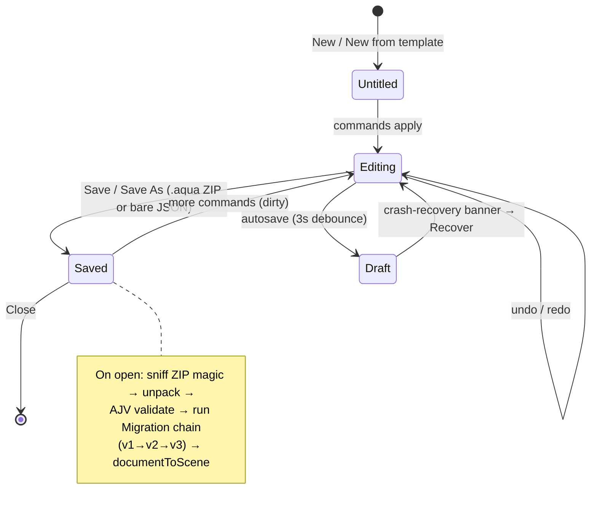
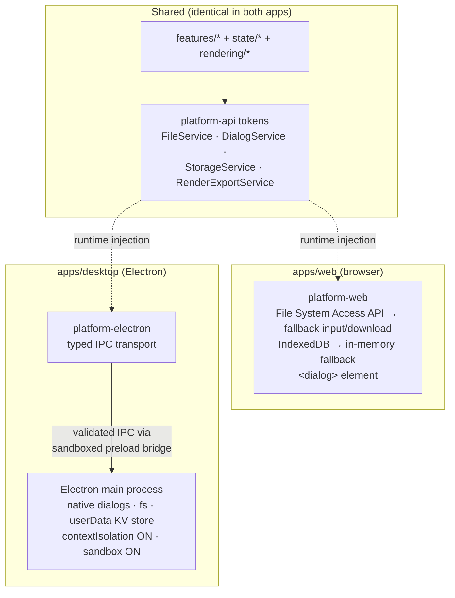

# Architecture overview

> **Load this when:** you want the big picture — what the layers are, how
> data flows, and why the codebase is shaped the way it is. Each section
> links to a deeper per-subsystem page.

Aquascape is an Nx monorepo that ships **one editor as two apps** (an
Angular web SPA/PWA and an Electron desktop app) over **one document
format** (`.aqua`) rendered by **two renderers** (Canvas2D for editing,
Three.js for the live 3D preview).

## The layer cake

Everything in `libs/` belongs to one of five layers. Dependencies only
point *downward*, and the rules are enforced mechanically by Nx tags +
`@nx/enforce-module-boundaries` — an illegal import fails `nx lint`.

The two invariants that make the diagram work:

1. **`domain/*` is framework-free.** No Angular, no DOM APIs (beyond type
   declarations in the rendering contract), no Electron, no NgRx. Pure
   TypeScript that runs anywhere — which is exactly why the 3D renderer,
   the headless demo recorder, and property-based tests could all be
   dropped in later without touching domain code.
2. **Interfaces sit between layers.** Features see `renderer-api` and
   `platform-api`, never `renderer-2d` or `platform-electron`. The apps —
   and only the apps — choose concrete implementations.

## The data flow: from click to pixel

Every edit follows one path. The UI **never** mutates the scene directly.

Because every `Command` is a **plain serializable record** with a pure
`applyCommand` / `invertCommand` pair, the same primitive powers:

- **Undo/redo** — the `History` keeps inverse commands; undo applies them.
- **Persistence** — the scene a command produced marshals losslessly to
  `.aqua`.
- **Locked layers** — `applyCommand` returns a typed rejection instead of
  mutating; the effect surfaces it as `commandRejected`.
- **Future collaboration** — commands are the wire format waiting to happen.

Deep dive: [Scene model & commands](scene-model-and-commands.md) ·
[State management](state-management.md)

## One document, two renderers

The `.aqua` document stores **one canonical coordinate space**: right-handed
3D millimetres, origin at the tank's front-bottom-left interior corner
(+x right, +y up, +z back). The 2D renderer projects along −z; the 3D
renderer consumes the same numbers directly. Neither invents its own space,
and neither ever writes back to the scene.

The editor hosts **two stacked `<canvas>` elements** — a canvas can hold
only one context type (2d vs webgl) for its lifetime — and swaps the active
renderer on toggle, disposing the old one.

Deep dive: [Rendering](rendering.md) ·
[Document format](document-format.md)

## The living tank: simulation pipeline

Stage 11 added a real-time fish simulation that runs *beside* the scene
model, not inside it. The document stores only species + quantity; the
simulation deterministically derives everything else from `scene.seed`.

Inside the world, systems run in a **fixed, load-bearing order** each tick:

Priority arbitration runs through a per-fish `BehaviorMode`: Fear can flip
FORAGE → REFUGE; Nipping and Territorial set PURSUE for a tick; Schooling
skips any fish whose mode isn't FORAGE so the dominant force isn't diluted.
The simulation steps at 30 Hz behind an accumulator while rendering runs at
60 Hz with interpolation.

Deep dive: [Livestock simulation](livestock-simulation.md)

## Document lifecycle

Deep dive: [Document format](document-format.md)

## One codebase, two apps

Electron security posture is non-negotiable: context isolation on, sandbox
on, no `nodeIntegration`, all native access through a typed preload bridge
with main-process-side validation, CSP enforced. Secrets (future AI
provider keys) live in OS secure storage / Electron main only.

Deep dive: [Platform abstraction](platform-abstraction.md)

## Determinism: the invisible architecture

A surprising amount of the codebase is shaped by one requirement: **given
the same document, every machine produces the same result.**

| Where | Mechanism |
| --- | --- |
| Scatter planting | Stratified grid + Mulberry32 jitter from `scene.seed` |
| Plant growth | Pure logistic function of catalog params + week |
| Fish spawning | Deterministic spawn from `scene.seed`; respawn keyed by a `spawnKey` fingerprint |
| Fish behaviour | Fixed-dt 30 Hz tick; byte-identical over a 1000-tick replay |
| Plant sway phase | `seededHash01(documentSeed ⊕ plantSeedMix, idHash)` per instance |
| Substrate grain, textures | `seededHash01` noise; offline-baked seeded PBR textures |
| Snapshot ordering | Bubble slabs sorted by `(sourceEid, spawnSeq)` because raw ECS entity-id order is not stable across worlds |

If you add anything random-looking, it must flow from the document `seed`
through a seeded PRNG — `Math.random()` in domain or rendering code is a
bug.

## Where to go next

| Subsystem | Page | Caveats (gotchas) |
| --- | --- | --- |
| Scene model & commands | [scene-model-and-commands.md](scene-model-and-commands.md) | [`caveats/scene-model.md`](../caveats/scene-model.md) |
| `.aqua` document format | [document-format.md](document-format.md) | [`caveats/document-format.md`](../caveats/document-format.md) |
| Rendering (2D + 3D) | [rendering.md](rendering.md) | [`caveats/renderer-2d.md`](../caveats/renderer-2d.md), [`caveats/renderer-3d.md`](../caveats/renderer-3d.md) |
| State (NgRx) | [state-management.md](state-management.md) | [`caveats/state-ngrx.md`](../caveats/state-ngrx.md) |
| Platform abstraction | [platform-abstraction.md](platform-abstraction.md) | [`caveats/platform.md`](../caveats/platform.md) |
| Catalog | [catalog.md](catalog.md) | [`caveats/catalog.md`](../caveats/catalog.md) |
| Livestock simulation | [livestock-simulation.md](livestock-simulation.md) | [`caveats/livestock-ecs.md`](../caveats/livestock-ecs.md) |
