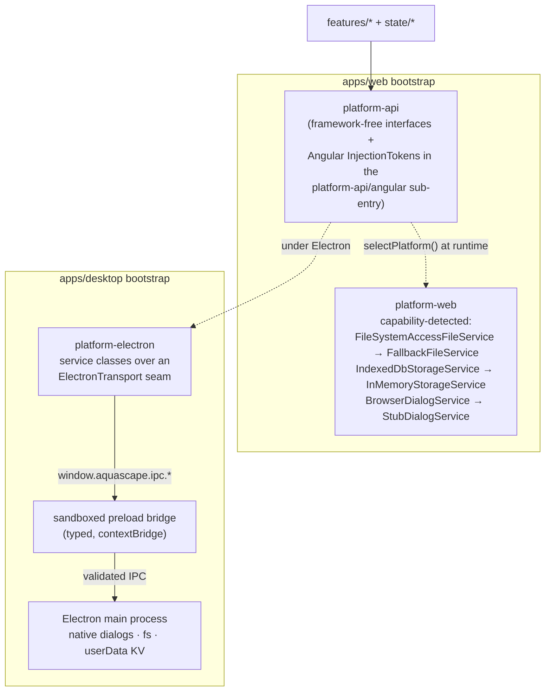
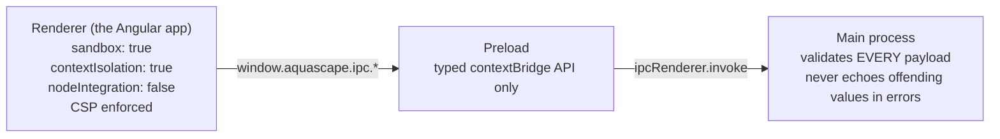

# Platform abstraction — one codebase, two apps

> **Load this when:** you want to understand how the same feature code runs
> in a browser and in Electron, or you're touching file IO, storage,
> dialogs, or the IPC contract.
> Sources: [`libs/platform/`](../../libs/platform/), [`apps/desktop/`](../../apps/desktop/).
> Gotchas: [`docs/caveats/platform.md`](../caveats/platform.md).

Features never know which platform they're on. They inject four interfaces
from `platform-api`; each app binds them to a concrete implementation at
bootstrap.

## The four services

| Interface | Job | Web binding | Electron binding |
| --- | --- | --- | --- |
| `FileService` | open/save `.aqua` documents | File System Access API (Chromium) → `<input type=file>` + `<a download>` fallback (Safari/Firefox) | native dialogs + `fs` in the main process |
| `DialogService` | confirmations, prompts | `<dialog>` element → stub fallback | native `dialog.showMessageBox` |
| `StorageService` | key-value persistence (autosave, recents, UI prefs) | IndexedDB → in-memory fallback | JSON-file KV at `userData/aquascape-storage.json` |
| `RenderExportService` | deliver exported images | `<a download>` + Blob URL | native save dialog + `fs` |

Notable design points:

- **`platform-api` is interface-only** and framework-free; the Angular
  `InjectionToken`s live in a separate `platform-api/angular` sub-entry so
  the interface file never imports `@angular/core`.
- **Capability detection, graceful degradation.** On browsers without the
  File System Access API, Save collapses into Save As (the legacy download
  flow has no stable file handle) — UIs detect this via `selectHasFile`
  staying false rather than sniffing user agents.
- **The transport seam is testable.** `platform-electron` wraps an
  `ElectronTransport`; `createIpcTransport(bridge)` is the real one,
  `createInMemoryTransport()` backs unit tests without Electron.

## Electron security posture (non-negotiable)

- `buildWebPreferences()` in `apps/desktop` is the security-flag source of
  truth — unit-tested field by field.
- All native access goes through the typed preload bridge; the renderer
  has no Node.
- Future secrets (AI provider keys) live in OS secure storage / the main
  process only — never in the renderer, never serialized into a document.

## Dev-server note

`nx serve desktop` launches Electron and the web dev-server in parallel
with no readiness wait — first launch can show `ERR_CONNECTION_REFUSED`.
Start `nx serve web` first, then `nx run desktop:serve-electron`.
