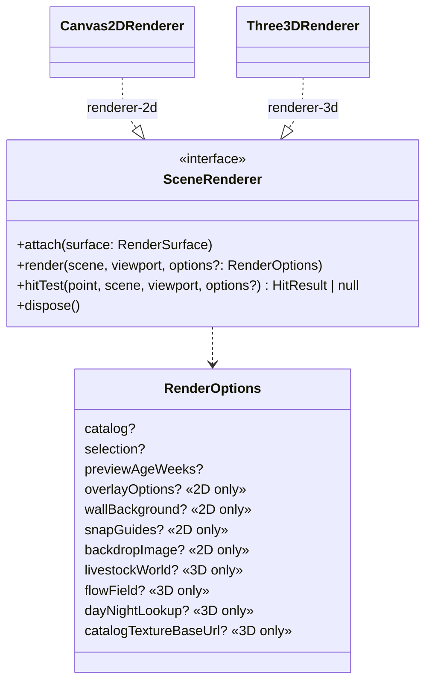
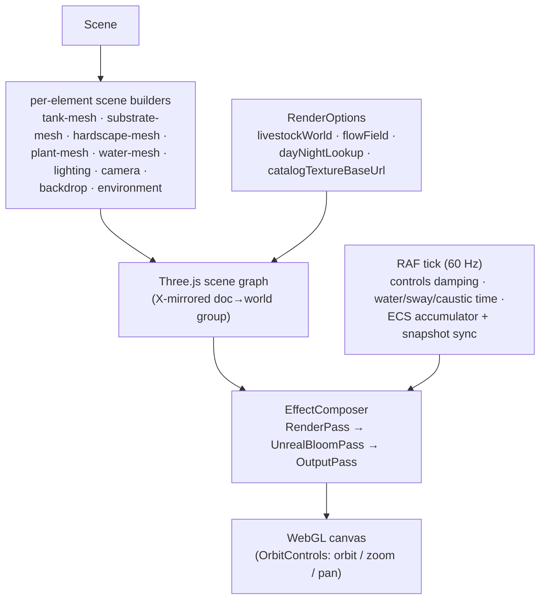
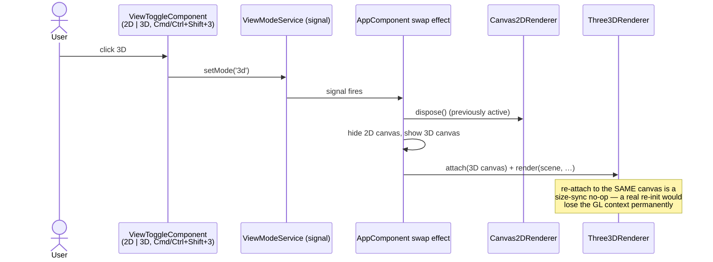

# Rendering — one interface, two renderers

> **Load this when:** you want to understand how a `Scene` becomes pixels —
> the `SceneRenderer` contract, the 2D editing canvas, the 3D Three.js
> view, and the 2D ⇄ 3D toggle.
> Sources: [`libs/rendering/`](../../libs/rendering/).
> Gotchas: [`docs/caveats/renderer-2d.md`](../caveats/renderer-2d.md),
> [`docs/caveats/renderer-3d.md`](../caveats/renderer-3d.md).

## The contract: `renderer-api`

[`libs/rendering/renderer-api/`](../../libs/rendering/renderer-api/) is a
**types-only** lib defining the `SceneRenderer` interface both renderers
implement. Features depend on this interface, never on a concrete
renderer — that one abstraction is what let the 3D renderer drop in years
of features later without touching a single feature lib.

The same document through both implementations:

| renderer-2d (editing) | renderer-3d (preview) |
| --- | --- |
|  |  |

Shared rules:

- **One coordinate space.** Both renderers consume the document's
  right-handed mm coordinates. The 2D renderer projects along −z (a front
  elevation); the 3D renderer consumes them directly. Renderers never
  invent their own space and **never write back to the Scene**.
- **Idempotent.** `render()` twice with the same inputs paints the same
  thing. Anything "random" (substrate grain, rock noise) is seeded.
- **Every optional field is off/no-op when omitted.** A 2D-only option is
  ignored by the 3D renderer and vice versa; `Viewport` itself is a 2D
  framing concept that the 3D renderer ignores (OrbitControls is its
  camera source of truth).
- **Dispose discipline.** Attach/dispose must be leak-free; the 3D side is
  leak-tested over 100 render/dispose cycles.

## renderer-2d — the editing surface

`Canvas2DRenderer` paints the front elevation the user edits. Paint order
is load-bearing (later = on top):

```mermaid
flowchart LR
    A["backdrop photo<br/>(CSS-pixel space)"] --> B[wall background] --> C["tank background<br/>(inside tank rect)"] --> D[grid] --> E[tank outline] --> F["substrate<br/>(Catmull-Rom + grain)"]
    F --> G[water tint] --> H[frame overlay] --> I[hardscape] --> J[plants] --> K["composition overlays<br/>(view-only)"] --> L["snap guides<br/>(view-only)"] --> M["selection handles<br/>(always last)"]
```

It is the only renderer with editing behaviour:

- **`hitTest` is fully wired** — handle-beats-body when a selection is
  supplied (a click on a corner handle inside a silhouette returns the
  handle, not the body).
- **Plant silhouettes are base-anchored** — growth scales upward while the
  roots stay planted at the authored Y.
- DPR-aware: the renderer owns the canvas *bitmap* size; the host's CSS
  owns the layout box. (Don't write inline canvas styles — see the caveat.)

## renderer-3d — the live preview

`Three3DRenderer` implements the same interface over Three.js/WebGL.
**Read-only by design**: `hitTest` returns `null`; no selection, no drag.

What it layers on top of the shared scene model:

- **Placement pipeline** (hardscape + plants, in this exact order): layer
  zone → world-Z band remap, tank clamp, substrate-Y snap, then
  deterministic per-vertex noise on rocks only (seeded per instance, so the
  same file always shows the same rock).
- **Fidelity stack**: ACES filmic tone mapping + sRGB output, a PMREM
  image-based-lighting environment, soft shadows, physically-based
  transmissive glass (open-topped), procedural caustics (floor + water
  surface), bloom, a scenic gradient backdrop, catalog-driven triplanar PBR
  textures (opt-in via `catalogTextureBaseUrl`), substrate grain, hardscape
  stone noise, cross-plane plant volume.
- **Animation inputs**: the animated water plane (≤ 2 mm sine bands at the
  adjustable waterline), height-weighted flow-coupled plant sway, the
  day-night lookup mutating cached lights per render — and the livestock
  world (next section).
- **The doc→world X-mirror**: the document and Three.js disagree on what
  +Z means; the renderer reflects content + lighting about the tank's
  X-midplane rather than negating Z in every builder. Don't remove it.
- **Capability gate**: `getRenderTargetEffectsSupported()` detects software
  WebGL / missing depth textures. Multi-pass render-target effects (SSAO,
  refraction) **must** gate on it — an ungated SSAO pass blanks the canvas
  under the SwiftShader path CI uses.

### livestock-renderer-3d

Fish never touch the Three.js scene-builder path. The
[`livestock-renderer-3d`](../../libs/rendering/livestock-renderer-3d/) lib
builds **one `InstancedMesh` per fish archetype** (plus instanced food
sprites and bubble billboards) and a single vertex/fragment shader pair:
carangiform tail-beat + per-fin flutter in the vertex stage, per-instance
colour + iridescent sheen in the fragment stage. It consumes only the
ECS `WorldSnapshot` typed-array slabs — it never imports bitECS. The
shader sits exactly at the WebGL 16-attribute budget; per-vertex data must
ride existing channels (see [`docs/caveats/livestock-ecs.md`](../caveats/livestock-ecs.md)).

## The 2D ⇄ 3D toggle

A `<canvas>` can hold only **one** context type for its lifetime — so the
app hosts two stacked canvases and swaps which renderer is live:

Pointer listeners (drag / marquee / selection) bind to the 2D canvas only;
OrbitControls owns the 3D canvas. View mode persists per user
(`aquascape.ui.viewMode`) and is never serialized into the document.

## Headless visual validation

Any visible renderer change can — and should — be checked headlessly:
Playwright + SwiftShader WebGL drives the dev server, screenshots the
canvas, and the e2e suite asserts pixel-variance and frame-diff floors
("a fish actually paints", "the canvas animates"). The README demo is
recorded the same way (`tools/demo/record-demo.mjs`). Full recipe:
[`docs/caveats/e2e.md`](../caveats/e2e.md).
