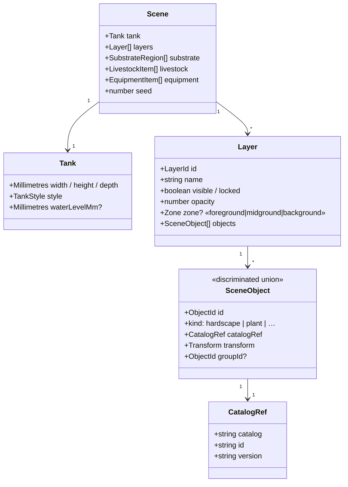
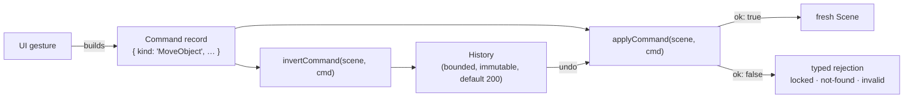

# Scene model & commands

> **Load this when:** you want to understand how the editor's in-memory
> model works — what a `Scene` is, how edits happen, and how undo/redo
> falls out for free. Source: [`libs/domain/scene-model/`](../../libs/domain/scene-model/).
> Gotchas: [`docs/caveats/scene-model.md`](../caveats/scene-model.md).

The scene model is **the heart of the app**. Every other subsystem either
produces a `Scene` (document loading), consumes one (rendering, export,
simulation), or mutates one (the command pipeline). It is framework-free
pure TypeScript — no Angular, no DOM, no NgRx.

## The data shape



Key properties:

- **Plain serializable data.** No class instances, no functions.
  `JSON.parse(JSON.stringify(scene))` is lossless. This is what makes the
  document round-trip, undo history, and (one day) collaboration cheap.
- **Catalog by reference.** Objects carry a `CatalogRef` — never inlined
  catalog data. The renderer joins object ↔ catalog row at draw time.
- **One coordinate space.** All positions are integer-preferred
  **millimetres** in a right-handed 3D space, origin at the tank's
  front-bottom-left interior corner (+x right, +y up, +z back).
- **`seed`** is the document-level entropy source for everything
  random-looking (scatter planting, fish spawning, plant sway phase).

## Commands: every mutation, one shape

A `Command` is a **plain discriminated-union record** (not a class — chosen
for trivial JSON round-trips and inspectability). Two free functions do all
the work:

```ts
applyCommand(scene, command): CommandResult   // { ok: true, scene } | { ok: false, reason, message }
invertCommand(scene, command): Command        // the undo record, derived BEFORE applying
```



The full union (see `commands.ts`) covers layer CRUD/reorder/zone, object
add/remove/move/reshape/mirror/group/z-order, tank dimensions/style/water
level, substrate region CRUD + profile, livestock add/remove/quantity, and
equipment add/remove/note/settings — plus `CompositeCommand`, which applies
children in order, inverts them in reverse, is atomic (any child rejection
rejects the whole), and counts as a single undo step.

### The rules that keep it honest

- **Pure + immutable.** Every `apply` returns a freshly spread /
  structured-cloned scene. No in-place edits, ever.
- **Invertible.** Some commands capture an `inverse` envelope at build time
  (e.g. `SetTankDimensions` records the positions it clamped so undo
  restores them exactly); some are self-inverse (`MirrorObject`).
- **Typed rejection, not exceptions.** Locked layers reject *object-level*
  commands with `{ ok: false, reason: 'locked' }`. Layer-metadata commands
  and global ops are not blocked — the lock guards content, not metadata.
- **Domain validation lives here.** Example: `MirrorObject` rejects
  `axis: 'y'` on plants — plants must grow upward; the UI disables the
  button, the command rejects anyway, and both renderers ignore a smuggled
  `flipY` as defence in depth.

### What is deliberately NOT a command

- `setScene` (Open / New / Recover) replaces the scene wholesale and
  **resets history** — you don't undo opening a file.
- `setTankPresetRef` is a metadata-only side edit.
- `Duplicate` is not a command kind — the selection inspector composes an
  `AddObject` of a cloned object with a fresh id and a 20 mm offset.

## Undo/redo

`History` is a bounded immutable structure (default 200 entries). Each
entry pairs the applied command with its precomputed inverse. Undo applies
the inverse through the same `applyCommand` path as everything else — there
is no second mutation mechanism to keep in sync.

## How the UI reaches it

The UI **never** calls `applyCommand` directly. Components dispatch the
NgRx `dispatchCommand` action; a scene effect applies the command and emits
`applyCommandSucceeded({ scene, history })` or `commandRejected`. See
[State management](state-management.md). One command per *commit cycle* —
a drag dispatches a single `MoveObject` on pointer-up, not one per
mousemove — so undo granularity matches user expectations.

## Adding a new mutation — checklist

1. Define the command record + `apply` + `invert` branches in
   `libs/domain/scene-model/` (or the relevant `*-commands.ts` sibling).
2. Exhaustive unit tests — including the invertibility property
   (`apply(invert(apply(s)))` restores `s`) and rejection paths.
3. Dispatch it from the feature via `dispatchCommand`.
4. If the mutation touches a new document field: follow the document-format
   checklist in [`docs/caveats/document-format.md`](../caveats/document-format.md)
   (schema + types + migration + fixtures move together).
5. Read [`docs/caveats/scene-model.md`](../caveats/scene-model.md) first —
   the lock-guard policy and serialization corner cases live there.
