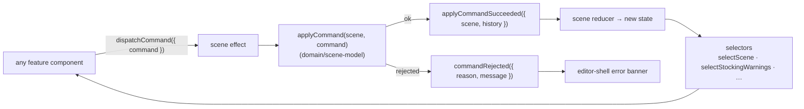
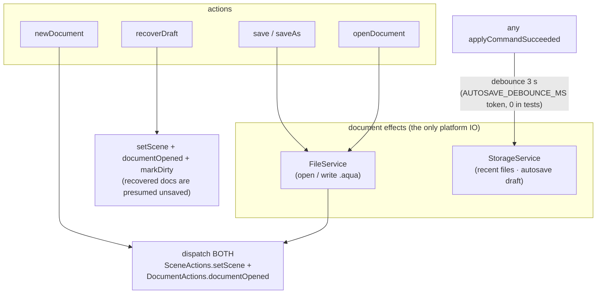

# State management (NgRx)

> **Load this when:** you want to understand how UI events become scene
> mutations, how documents open/save/autosave, and how selection works.
> Source: [`libs/state/`](../../libs/state/).
> Gotchas: [`docs/caveats/state-ngrx.md`](../caveats/state-ngrx.md).

The store is the seam between the Angular UI and the framework-free domain
layer. Three slices, each with a narrow job:

| Slice | Owns | Notable |
| --- | --- | --- |
| `state/scene` | the live `Scene` + undo/redo `History` | the generic command pipeline |
| `state/document` | file identity, dirty flag, recent files, autosave draft | all platform IO lives in its effects |
| `state/selection` | `{ ids: ObjectId[] }` | transient editor state, never persisted |

## The command pipeline

Every feature dispatches the same generic action. There is exactly one
place where `applyCommand` is called:

- **Undo/redo** are actions on the same slice, replaying inverse commands
  from `History`.
- **`setScene`** (Open / New / Recover) replaces the scene wholesale and
  resets history — deliberately not a command.
- **Derived state lives in selectors** — e.g. `selectStockingWarnings`
  runs the `domain/stocking` rules engine over the live scene + bundled
  catalog; components never re-derive it.

## Document lifecycle effects

`state/document` effects own *all* platform IO through the `platform-api`
tokens (so the same effects run in the browser and in Electron):

The **cross-store dispatch** pattern is deliberate: opening a file emits
both `setScene` and `documentOpened` so the scene and document reducers
stay decoupled but land consistently. A `resetOnSceneReplace$` effect in
the selection slice observes `setScene` and clears the selection so a new
document never carries stale ids.

**Autosave / crash recovery:** drafts persist as a versioned payload at
`aquascape.autosaveDraft`, cleared on any successful save.
`DocumentEffects.bootstrap()` runs once from the composition root to prime
recent files and detect a crash draft — which surfaces as the recovery
banner in the toolbar.

## Conventions

- Reducers preserve object identity on no-op transitions (e.g.
  `clearSelection` on an already-empty set) so `OnPush` components don't
  redraw spuriously.
- Components select; effects do IO; reducers stay pure. If a component
  needs data that isn't a selector yet, add the selector.
- Testing uses `provideMockStore` — but beware: selector overrides leak
  across `TestBed.resetTestingModule()`; set every selector value in every
  test (see the caveat file).
