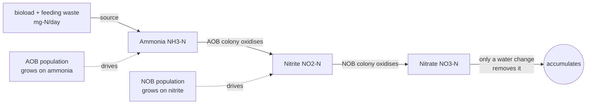
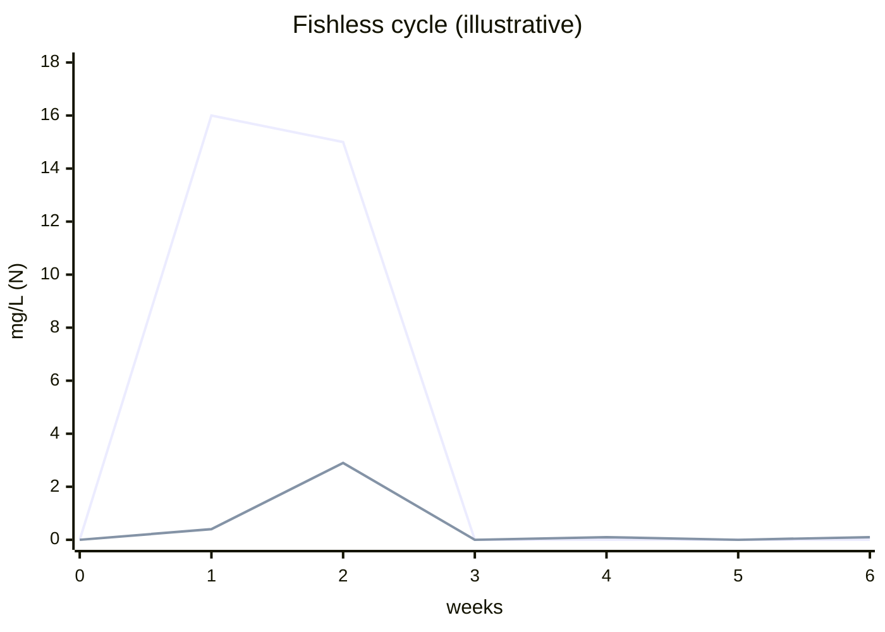

# Water chemistry (the `domain/water-sim` model)

Stage 13 (husbandry) adds a deterministic aquarium water-chemistry simulation:
the nitrogen cycle (ammonia → nitrite → nitrate), tank cycling, pH drift, and
algae growth. It is the pure, framework-free sibling of
[`domain/growth-sim`](../caveats/growth-sim.md) and follows
[ADR-0006](../decisions/0006-water-sim-lib-and-chemistry-state.md): the **model
lives in `libs/domain/water-sim/`; the persistent state lives in the `.aqua`
document**; the live tick is a thin runtime service.

This page describes the F13.1 model. For the load-bearing constants, sources,
and determinism rules, see [`docs/caveats/water-sim.md`](../caveats/water-sim.md).

## Boundary

```
domain/stocking ──bioload (mg-N/day)──▶ domain/water-sim ──▶ WaterState
                                              │
                            (F13.2) persisted in .aqua Tank.waterChemistry
                            (F13.3) ticked by a runtime WaterChemistryService
```

`domain/water-sim` depends only on other `domain/*` libs. No Angular, no DOM, no
Electron, no `Date.now()`, no `Math.random()`. Time is an input (`elapsedWeeks` /
`dt`). Same `(params, state, inputs, seed)` ⇒ byte-identical evolution.

## The two-stage nitrogen cycle



Two bacterial guilds — ammonia oxidisers (AOB) and nitrite oxidisers (NOB) —
have populations that grow logistically over sim-time toward a carrying capacity
set (Monod saturation) by their food: ammonia for AOB, nitrite for NOB. Because
NOB only have food once AOB produce nitrite, **stage 2 lags stage 1**. That lag
is the classic fishless-cycle curve:



Ammonia spikes then falls as AOB establish; nitrite spikes a little later then
falls as NOB establish; nitrate accumulates monotonically (only a `WaterChange`
Command removes it — there is no decay term in the model).

## The step function

```ts
simulateChemistry(
  params: WaterChemistryParams,   // volumeLitres, kh, temperatureC
  state: WaterState,              // ammonia/nitrite/nitrate/ph + aob/nob colonies + ageWeeks + engineVersion
  elapsedWeeks: number,           // TIME IS AN INPUT
  sourceN: number,                // ammonia source as mg-N/day (bioload + feeding hook)
  seed: number,                   // document seed → all jitter
): WaterState
```

Pure, total, non-mutating. Internally it integrates with a fixed-Euler
`STEP_DAYS = 0.25` sub-step; each step adds the (jittered) source, grows/decays
the colonies, runs the two Monod-limited mass-conserving conversions, and drifts
pH down by KH-buffered nitrification acid. Outputs are rounded to 4 dp so the
persisted state is byte-stable across JS engines.

Supporting functions:

- `cycleProgress(state) -> 'uncycled' | 'cycling' | 'cycled'` — `cycled` needs
  both nitrogen species at/below the safe floor AND both colonies established;
  high nitrate does **not** block `cycled` (it's the water-change signal).
- `freeAmmoniaFraction(ph, temperatureC)` / `freeAmmonia(totalN, ph, t)` — the
  NH3/NH4+ equilibrium (Emerson et al. 1975). High pH/temperature ⇒ more of the
  toxic un-ionised form for the same test-kit reading.
- `algaeGrowth(type, nitrate, lightHours, flow, dt)` — per-type growth increment
  (green-spot / hair / black-beard / diatom), each with its own nutrient + light
  + flow niche.

## Determinism + versioning

All jitter derives from the document `seed` via stable per-purpose channels
(`signedJitter(seed, channel, step)`), with `step` keyed to the running
`ageWeeks` clock so the stream is call-split invariant. `ENGINE_VERSION` is
stamped on every output; bump it whenever the rate model changes outputs so
saved sims replay under their original model or migrate explicitly. A golden
snapshot test guards against accidental rate-model drift.
