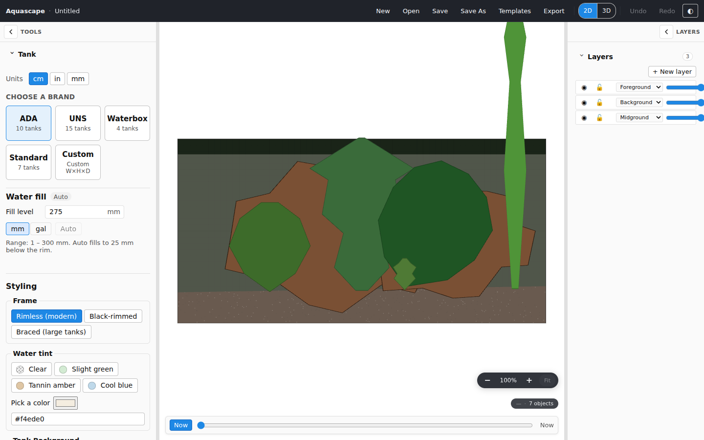
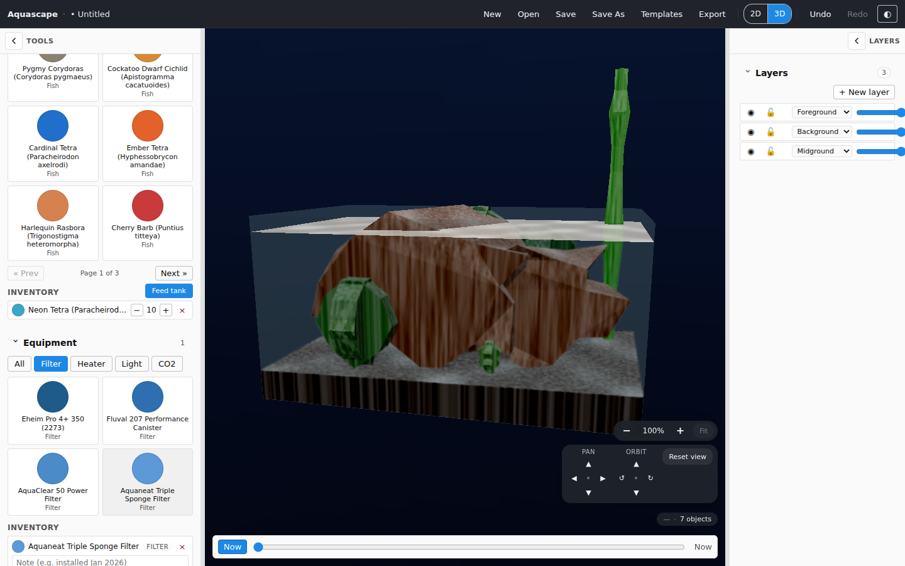
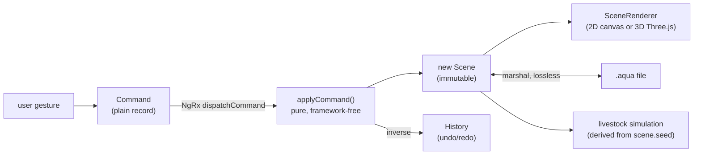
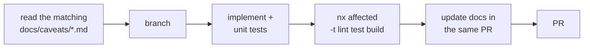

# New-developer guide

> **Load this when:** you're new to the codebase — whatever your level or
> role. This guide gets you from clone to confident first contribution,
> with paths for different backgrounds.

**Contents:**
[Setup](#1-setup-15-minutes) ·
[First tour](#2-a-guided-tour-of-the-running-app) ·
[Mental model](#3-the-mental-model-in-one-diagram) ·
[Codebase tour](#4-codebase-tour--where-things-live) ·
[Choose your path](#5-choose-your-path-by-role--interest) ·
[First contribution](#6-your-first-contribution-step-by-step) ·
[Testing](#7-testing--what-runs-where) ·
[Rules](#8-the-rules-that-will-actually-bite-you) ·
[FAQ](#9-faq)

---

## 1. Setup (15 minutes)

Prerequisites: **Node** (version pinned in `.nvmrc` — use `nvm use` or
[fnm](https://github.com/Schniz/fnm)) and **git**. The package manager is
**pnpm**, pinned and installed automatically via corepack:

```bash
git clone https://github.com/joebarbere/aquascape.git
cd aquascape
corepack enable          # one-time: activates the pinned pnpm
pnpm install
pnpm exec nx serve web   # → http://localhost:4200
```

You should see the editor: a toolbar, a left sidebar of tools, the tank
canvas, and a right rail with panels. If you do — you're set up.

Other commands you'll use constantly:

```bash
pnpm exec nx test <project>        # one project's unit tests (e.g. domain-scene-model)
pnpm exec nx run-many -t test      # everything
pnpm exec nx run-many -t lint      # lint, including module-boundary checks
pnpm exec nx graph                 # interactive dependency-graph browser ← genuinely useful
pnpm format                        # nx format:write
```

> **Desktop app:** `pnpm exec nx serve desktop` runs the web dev-server and
> Electron in parallel — but there's a startup race; if you get
> `ERR_CONNECTION_REFUSED`, start `nx serve web` first, then
> `pnpm exec nx run desktop:serve-electron`.

## 2. A guided tour of the running app

<p align="center">
  <br/>
  <sub>The 2D editor — tools sidebar · tank canvas (Jungle template) · layers panel · growth time slider.</sub>
</p>

Spend ten minutes using the product — every subsystem you'll work on is
visible from the UI:

1. **Templates → "New from template" → Iwagumi.** A populated scene
   appears. You just exercised the document format and the marshal.
2. **Drag a rock.** Notice the snap guides and the mm readout. Press
   `Cmd/Ctrl+Z` — undo works because the drag dispatched a `Command`.
3. **Scrub the time slider** (toolbar) — plants grow deterministically
   over weeks 0–52.
4. **Add fish:** Livestock tool → add a school of neon tetras. Note the
   stocking warnings panel reacting.
5. **Press `Cmd/Ctrl+Shift+3`** — the 3D view. Orbit with the mouse. The
   tetras school; if you added hardscape, scared fish hide behind it. Try
   the "Feed tank" button and the day-night slider in the right rail.

   <p align="center">
     <br/>
     <sub>The same document, one keypress later — the read-only 3D view with orbit controls.</sub>
   </p>
6. **Save** (`Cmd/Ctrl+S`) — you get a `.aqua` file. Rename it to `.zip`
   and look inside, or open `example.aqua.json` at the repo root to see
   the format as bare JSON.

## 3. The mental model in one diagram

If you remember one thing, make it this loop:



Four invariants fall out of it — they're enforced by lint and tests, so
internalize them early:

1. **`domain/*` is framework-free.** Pure TypeScript. No Angular, NgRx,
   DOM, or Electron imports.
2. **The UI never mutates the scene.** Everything goes through a
   `Command`.
3. **Features depend on interfaces** (`renderer-api`, `platform-api`),
   never concrete renderers/platforms.
4. **Everything random is seeded.** Same document ⇒ same result on every
   machine. `Math.random()` in domain or rendering code is a bug.

The full picture: [architecture/overview.md](../architecture/overview.md).

## 4. Codebase tour — where things live

```
apps/web/            the browser app + composition root (start reading at app.component.ts)
apps/desktop/        Electron main + preload (security flags, IPC, native dialogs)
apps/web-e2e/        Playwright specs that drive the real app

libs/domain/         ← pure logic; most of the interesting code
  scene-model/         Scene types + EVERY Command + undo history
  document/            .aqua schema, validator, migrations, marshal
  catalog/             all content as JSON manifests + loader
  geometry/            vectors, transforms, hit-testing, seeded hashing
  growth-sim/          plant growth math + scatter placement
  stocking/            the warning rules engine
  livestock-*/ fluid-sim/ fish-anatomy/   the fish simulation (see below)

libs/rendering/      renderer-api (the interface) + renderer-2d + renderer-3d + livestock-renderer-3d
libs/features/       one Angular lib per tool/panel
libs/state/          NgRx slices: scene, document, selection
libs/platform/       platform-api interface + web + electron implementations
libs/testing/        fast-check arbitraries + round-trip property suite

docs/                you are here — hub, architecture, glossary, caveats, ADRs, history
plans/               per-feature implementation plans
tools/               icons, packaging, validators, texture baker, demo recorder
```

Two reading orders that work:

- **Bottom-up (backend instinct):** `libs/domain/scene-model/src/types.ts`
  → `commands.ts` → `libs/domain/document/src/aqua-document.ts` →
  `libs/state/scene/`.
- **Top-down (frontend instinct):** `apps/web/src/app/app.component.ts`
  (the composition root) → a small feature lib like
  `libs/features/layers-panel/` → follow a dispatch into `libs/state/`.

## 5. Choose your path (by role / interest)

| You are… | Start with | Then |
| --- | --- | --- |
| **Frontend / Angular dev** | [State management](../architecture/state-management.md), a feature lib (`layers-panel` is the smallest) | `docs/caveats/app-shell.md`, `docs/caveats/state-ngrx.md` |
| **Backend / data-modelling dev** | [Scene model & commands](../architecture/scene-model-and-commands.md), [Document format](../architecture/document-format.md) | the round-trip suite in `libs/testing/` |
| **Graphics / rendering dev** | [Rendering](../architecture/rendering.md), then `libs/rendering/renderer-3d/src/scene-builder/` | `docs/caveats/renderer-3d.md` (long, but every section earned its place) |
| **Game-dev / simulation dev** | [Livestock simulation](../architecture/livestock-simulation.md), then `libs/domain/livestock-ecs/src/lib/systems/` | `docs/caveats/livestock-ecs.md`, the perf bench |
| **QA / test engineer** | [Testing](#7-testing--what-runs-where) below, `apps/web-e2e/` | `docs/caveats/e2e.md` (headless WebGL is full of traps) |
| **Designer / UX** | The [running-app tour](#2-a-guided-tour-of-the-running-app), `libs/features/` component templates | the accessibility notes in the DoD (`CLAUDE.md`) |
| **Content contributor (no code)** | [Catalog](../architecture/catalog.md) — entries are JSON files | `docs/caveats/catalog.md` ("no fabricated data" rules) |
| **Aquascaping hobbyist, new to code** | The [glossary](../glossary.md) maps hobby terms ↔ code terms | the app tour, then the catalog (closest to the hobby) |
| **Just exploring** | [Architecture overview](../architecture/overview.md) | [Development history](../history.md) for the story so far |

## 6. Your first contribution, step by step

Good first issues by flavour:

- **Easiest (data-only):** add a catalog entry — a new plant, rock, or
  fish. JSON manifest + one import line + validator run. Follow
  [architecture/catalog.md](../architecture/catalog.md).
- **Small UI:** a new panel control in a feature lib (pattern-match an
  existing accordion in `editor-shell`).
- **Domain logic:** a new stocking rule in `libs/domain/stocking/`
  (pure function + exhaustive tests).
- **A new editor mutation:** a new `Command` (read
  [scene-model-and-commands.md](../architecture/scene-model-and-commands.md)
  — there's a checklist).

The workflow:



1. **Before touching an area, read its caveat file** —
   [`docs/caveats/`](../caveats/) is indexed by area with "Load this
   when…" triggers. This is the project's institutional memory; it will
   save you from re-discovering a known trap.
2. Run what CI runs: `pnpm exec nx affected -t lint test build`.
3. **The Definition of Done** (from `CLAUDE.md`): typed public API, unit
   tests, at least one component/e2e test through the UI, a docs entry,
   keyboard + ARIA accessibility, and README/CLAUDE/caveats updated in the
   same PR. Domain libs target ≥ 90 % coverage.
4. Documentation drift is treated like a failing test — if your change
   makes a doc stale, fixing the doc is part of the change.

## 7. Testing — what runs where

| Layer | Tool | Example |
| --- | --- | --- |
| Domain logic | Jest, exhaustive | `nx test domain-scene-model` |
| Document round-trips | fast-check property tests | `nx test testing -t document-round-trip` (required on main) |
| Components | Jest + Angular Testing Library | feature lib specs |
| Real browser / WebGL | Playwright (`apps/web-e2e`) | `pnpm exec nx run web-e2e:e2e` |
| Simulation performance | opt-in bench | `BENCH=1 nx test domain-livestock-ecs -t perf-bench` |

Two habits specific to this repo:

- **Property tests for invariants:** command invertibility and document
  round-trips are tested with generated inputs, not hand-picked examples.
- **Visual assertions use floors, not pixels:** the e2e suite asserts
  pixel-channel *variance* (canvas isn't blank) and frame-*diff* (it's
  animating) — never exact-pixel snapshots. Renderer changes can be
  validated headlessly with Playwright + SwiftShader; the recipe is in
  [`docs/caveats/e2e.md`](../caveats/e2e.md).

## 8. The rules that will actually bite you

The short list of things newcomers trip on (each links to the full story):

- **A `<canvas>` can hold one context type forever** — hence two stacked
  canvases for the 2D/3D toggle. ([renderer-3d caveats](../caveats/renderer-3d.md))
- **`WebGLRenderer.dispose()` permanently kills the canvas's GL context** —
  `attach()` must be idempotent on the same canvas. (same file)
- **Schema and types move together** — `aqua-document.ts`,
  `aqua-document.schema.json`, `example.aqua.json`, and scene-model's
  mirror, in one PR, with a migration. ([document-format caveats](../caveats/document-format.md))
- **No `Math.random()`** in domain/rendering — seeded hashing only; the
  livestock lib lint-bans it. ([livestock-ecs caveats](../caveats/livestock-ecs.md))
- **Module boundaries are lint rules** — `features/*` importing
  `platform-electron` fails `nx lint`, not code review.
- **"Absent" is meaningful in documents** — optional fields like
  `waterLevelMm` must not be materialised by migrations or marshals.
- **The livestock shader is at the 16-attribute WebGL budget** — adding a
  vertex attribute silently breaks all fish rendering under
  ANGLE/SwiftShader. ([livestock-ecs caveats](../caveats/livestock-ecs.md))

## 9. FAQ

**Where do I see all projects?** `pnpm exec nx show projects`, or
`pnpm exec nx graph` for the visual.

**Why is everything in millimetres?** One canonical integer unit kills
rounding drift and unit confusion. Display units (cm/in/gal) are converted
at the edge.

**Why plain command records instead of command classes?**
`JSON.parse(JSON.stringify(cmd))` must be lossless — trivial round-trips,
inspectability, and a future wire format.

**Why don't fish positions get saved?** The document stores species +
quantity + `seed`; the simulation re-derives identical motion. Smaller
files, no stale state.

**Something about the area I'm touching seems weird/arbitrary.** Check
the caveat file first, then [`docs/decisions/`](../decisions/) — if it's
genuinely undocumented, that's a docs bug; ask, then write down the answer.

**Who/what is CLAUDE.md for?** Instructions for AI-assisted development
(Claude Code) — the invariants there bind human contributors just the
same; it's also the most current "state of the repo" snapshot.
